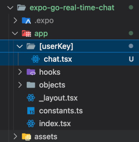

# Real-time chat with Expo Go and React Native
## Session 6 - Adding a chat route

Now that the landing page is up and running, let's update out routing that is managed in `/app/_layout.tsx` so that we can navigate from the landing page to a new chat screen.

1. Open the `/app/_layout.tsx` file now.  The `<Stack/>` component that you see there is a central to Expo Go in how it manages what screens that are available within your application and how users navigate between these screens.

We are going to add a new `<Stack.Screen/>` here for the chat screen.  Not only that, but we will be passing the Firebase userKey as a parameter so that the chat screen knows who you are now that the landing screen has identified that information.

2. Add a new `<Stack.Screen/>` to the `/app/_layout.tsx` file.
```tsx
<Stack.Screen name="[userKey]/chat" options={{title: 'Technology Camp Chat'}}/>
```

3. Create a new folder named "[userKey]" to where it will be found under the `/app` folder.  

4. Under the `/app/[userKey]` folder, create a file named `chat.tsx`.

Your application folder structure should look like this now:



5. Open the `/app/index.tsx` for the landing screen.  We will be making this screen navigate to the `chat` screen and provide the `userKey` it has identified.

6. Import the `Href` and the `useRouter` hook at the top of this file.
```tsx
import { Href, useRouter } from "expo-router";
```

7. Add the Expo Go router to this component by adding the below line below the Index() function declaration:
```tsx
const router = useRouter();
```

8. Lastly, replace the below lines:
```tsx
alert(`Continue pressed. Current userKey in firebase is: ${userData.key}`);
// In the next session we will have the application change to a new chat screen with this user information.
```
With this:
```tsx
const homeRoute = `/${userData.key}/chat` as Href;
router.replace(homeRoute);
```
The result should look like this: 
```tsx
import { useState } from "react";
import { Pressable, StyleSheet, Text, TextInput, View } from "react-native";
import Constants from "@/app/constants";
import useFirebaseUserData from "@/app/hooks/useFirebaseUserData";
// Add this to your imports.
import { Href, useRouter } from "expo-router";

export default function Index() {
  const [userName, setUserName] = useState<string>('');
  const {findByUserName, storeNewUserData} = useFirebaseUserData(null);
  // Now add this here so that you have the Expo Go router available.
  const router = useRouter();
  
  const storeUserName = async () => {
      if (!userName) {
          return;
      }
      const existingUserData = findByUserName(userName);
      let userData;
      if (existingUserData) {
          console.log(`The user name ${userName} already exists.  Assuming identity of that user. (userKey: ${existingUserData.key})`);
          userData = existingUserData;
      } else {
          userData = await storeNewUserData(userName);
      }
      // Add this here replacing what was there before.
      // This will have this screen transition to the chat screen/route when the userName is identified.
      const homeRoute = `/${userData.key}/chat` as Href;
      router.replace(homeRoute);
  };
...
```

That should be it for the landing screen.  Let's define the `/app/[userKey]/chat.tsx` component for the application.

9. Open the `/app/[userKey]/chat.tsx` file.

10. Paste the below content into this file.
```tsx
import { Text, View } from "react-native";
import { useLocalSearchParams } from "expo-router";

export default function Chat() {
    const { userKey } = useLocalSearchParams();

    return (
        <View>
            <Text>Welcome to the chat screen!</Text>
            <Text>userKey: {userKey}</Text>
        </View>
    );
}
```
Notice the `useLocalSearchParams` from "expo-router".  With this, we can retreive the `userKey` passed from the landing screen we worked on earlier.

Now when you enter a user name on the landing screen and click on the Continue button, you should be taken to this new chat screen and your Firebase userKey should be identified.

### SESSION COMPLETE

Up next -> [Session 7 - Chat screen layout and initial setup](session-7-chat-screen-layout-and-initial-setup.md)
